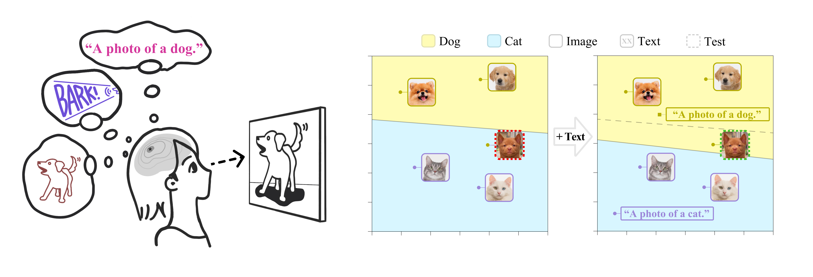

# Cross-Modal Adaptation with Multimodal Models
This repository contains code for paper [Multimodality Helps Unimodality:
Cross-Modal Few-Shot Learning with Multimodal Models](https://arxiv.org/abs/2301.06267). It contains the code for vision-language adaptation on 11 target image classification datasets and experiments on ImageNet-ESC benchmark for audiovisual few-shot learning.



# Environment Configuration
We recommend to install the environment through conda and pip. You should make a new environment with python>=3.9, for example:

```
conda create -n cross_modal python=3.9
```

Next, you can download pytorch from official site, for example:

```
conda install pytorch torchvision torchaudio cudatoolkit=11.3 -c pytorch
```

Next, run `pip install -r requirements.txt` in this repo to install a few more packages required by [CLIP](https://github.com/openai/CLIP). 

# Dataset Installation
Follow [DATASETS.md](DATASETS.md) to install the downstream datasets. We use the [CoOp](https://github.com/KaiyangZhou/CoOp) split of data (including the few-shot splits for seed 1-3, except for ImageNet) to ensure a fair comparison.


# Model Training


## Path Configuration
You should modify the paths to dataset and results at [engine/config/default.py](engine/config/default.py), e.g., you may want to modify the `DATA_DIR` to where you install all the datasets. Default is to save under the current folder.

## Sample few-shot train/val split
We already provide few-shot train/val splits for seed (1, 2, 3), and shots (1, 2, 4, 8, 16) in [indices/](indices/), as if they were generated from the original [CoOp codebase](https://github.com/KaiyangZhou/CoOp) (except for ImageNet that we sampled our own split). If you just intend to follow CoOp's protocol, you may proceed to the next step.

If you want to generate more splits with different shots and seeds, please refer to [few_shot_split.py]. For example, to generate a few-shot train/val split for imagenet with seed 6, you may run the below script:

```
python few_shot_split.py --dataset imagenet --train-shot 1 --seed 6
```

## Feature Extraction
For all the linear/partial/adapter experiments, we pre-extract the features to speed up training time. You can use [features.py](features.py) to pre-extract image and text features from a frozen CLIP model. For example, run the below script to pre-extract last layer features for imagenet-16-shot with RN50 backbone. Note that these features are not L2-normalized yet:

```
python features.py --dataset imagenet --train-shot 16 --seed 1 --clip-encoder RN50 --image-layer-idx 0 --text-augmentation hand_crafted --image-augmentation none --image-views 0
```

To reproduce the experiments in main paper (with flipped view and hand-crafted template), you may run the bash script below to extract for all 11 datasets and 3 seeds. (Tip: You can also parallelize the scripts in [features.sh](features.sh) to speed up):

```
bash features.sh
```

## Few-Shot Training
To perform cross-modal or uni-modal training, please refer to [train.py](train.py). For example, if you want to run cross-modal adaptation for imagenet-16-shot, you can run:

```
python train.py --modality cross_modal --classifier_head linear --classifier_init zeroshot --logit 4.60517 --hyperparams linear --dataset imagenet --train-shot 16 --seed 1 --clip-encoder RN50 --image-layer-idx 0 --text-augmentation hand_crafted --image-augmentation flip --image-views 1
```

To reproduce the numbers in main paper, please run [linear_prob.sh](linear_prob.sh), [partial_finetuning.sh](partial_finetuning.sh), and [adapter.sh](adapter.sh). To speed up the experiments, you can run scripts in parallel if you have multiple GPUs. To check all the supported argparse arguments, please see this [file](engine/config/__init__.py).

## Evaluation
To perform hyperparameter search with few-shot validation set performance, we provide [eval.py](eval.py). For example, to collect results of cross-modal linear probing:

```
python eval.py --mode linear --modality cross_modal --classifier_init zeroshot --clip-encoder RN50 --text-augmentation hand_crafted --image-augmentation flip --image-views 1
```

## Average over 11 datasets
To compute average over 11 datasets, for example for the script above, you may run the following script to generate a csv file:
```
python average.py --name all_RN50_linear_hand_crafted_flip_1_cross_modal_text_wiseft_False
```

## Test-time robustness to domain shift (ImageNet)

To reproduce the domain shift experiments in paper please run [domain_shift.py](domain_shift.py). All the argparse arguments follow that of [train.py](train.py):

```
python domain_shift.py --modality cross_modal --classifier_head linear --classifier_init zeroshot --logit 4.60517 --hyperparams linear --dataset imagenet --train-shot 16 --clip-encoder RN50 --image-layer-idx 0 --text-augmentation hand_crafted --image-augmentation none --seed 1
```

After training, to evaluate for 3 seeds, you can use [eval_domain_shift.py](eval_domain_shift.py):

```
python eval_domain_shift.py --mode linear --modality cross_modal --classifier_init zeroshot --clip-encoder RN50 --text-augmentation hand_crafted --image-augmentation none
```

You can get Cross-Modal WiSE-FT result via enabling the `wise_ft` flag:

```
python eval_domain_shift.py --mode linear --modality cross_modal --classifier_init zeroshot --clip-encoder RN50 --text-augmentation hand_crafted --image-augmentation none --wise_ft True
```


# ImageNet-ESC Experiments
## AudioCLIP feature extraction for ESC50
We follow the instruction offered in official [AudioCLIP codebase](https://github.com/AndreyGuzhov/AudioCLIP) to extract the feature. We notice that the AudioCLIP head does not produce good audio features with `eval()` mode, so we extract the features in `train()` mode with a batch size of 10. The [ESC-50 dataset](https://github.com/karolpiczak/ESC-50) recommended 5-fold cross validation because the audio samples can be correlated within each of the 5 folds, so we follow the practice to offer 5 train/test split of ESC-50. For each split, one fold is used as trainset (400 audio samples per fold), and the rest 4 folds are used for evaluation.

To extract features (assuming you followed the dataset installation instruction) to ESC-50 folder, please run the script below. Before you run this, please modify the `PATH` variable if you install ESC-50 somewhere else.

```
cd audioclip/
python audio_features.py
```

## Training on ImageNet-ESC
To reproduce all the experiments in paper with 1/2/4 shot classification on both image and audios, please run:
```
python imagenet_esc.py
```


<!-- ## Citation
If you use this code in your research, please kindly cite the following papers -->
